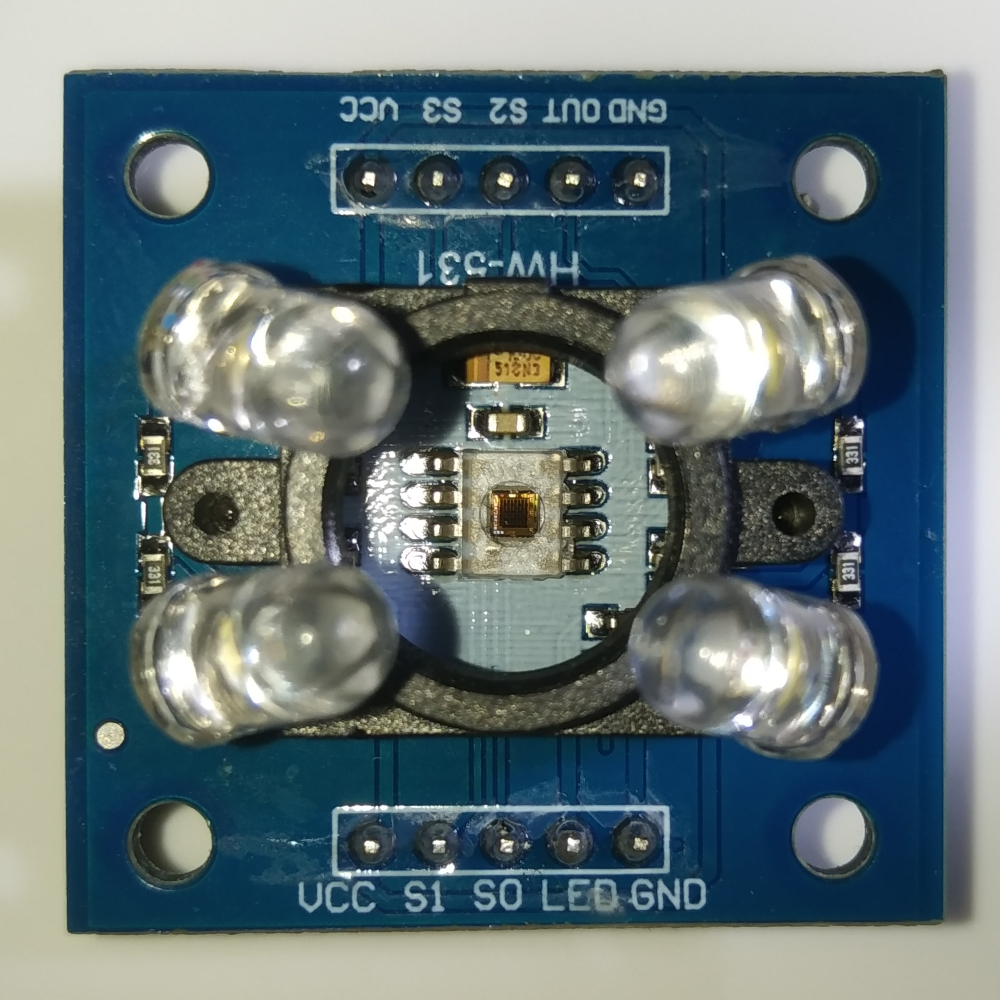

# TCS3200 Color Sensor Arduino Library


Color sensing is a crucial aspect of many modern applications, from color detection and sorting in industrial processes to smart home automation systems. The TCS3200 color sensor is a widely used device for color sensing due to its simplicity, accuracy, and ease of integration. To harness the full potential of this sensor, this library was developed, a powerful and user-friendly API that allows Arduino developers to interface with the TCS3200 sensor effortlessly.

<p align="center">
	
	<br/>
	<small><i>TCS3200 Color Sensor</i></small>
</p>

The TCS3200 color sensor is a programmable device that can detect and measure the intensity of light across different color channels. It comes equipped with an array of photodiodes, each covered by a specific color filter: red, green, blue, and clear. The clear photodiode captures ambient light and is used to calculate the overall intensity.

Also, the sensor has two main operating modes: frequency and analog output. In frequency mode, the sensor outputs a square wave with a frequency proportional to the intensity of light detected. In analog output mode, the sensor provides a voltage output proportional to the intensity.

## Library Overview

The TCS3200 Arduino Library is designed with simplicity and extensibility in mind. It offers a wide range of functionalities, from basic color sensing to advanced features like white balancing, color space conversions, and nearest color detection.

Here's an overview of the key functions and their roles in the library:

- **Initialization**

    The `begin()` function initializes the TCS3200 sensor by configuring the necessary pins and setting default integration time and frequency scaling.

- **Color Reading**

    Access the red, green, and blue intensity values captured by the TCS3200 color sensor. These raw RGB values can be used to analyze the color composition of an object or its surroundings. The library provides four functions to read the intensity of each color channel: `read_red()`, `read_green()`, `read_blue()`, and `read_clear()`. The clear channel reading is used for calibration and to calculate the RGB color intensity values.

- **Calibration**

    Achieve better color accuracy with sensor calibration. The library includes methods to calibrate the sensor in both light and dark environments, resulting in more reliable and consistent color measurements.

    The `calibrate()`, `calibrate_light()`, and `calibrate_dark()` function enables calibration of the sensor. Calibration involves capturing readings for both the lightest and darkest colors to establish the range for color intensity mapping.

- **Integration Time**

    Set integration time and frequency scaling to adapt to different lighting environments. The `integration_time()` function allows users to get and set the integration time for each color reading, affecting the accuracy and sensitivity of color measurements on calibration. Integration time determines the period for which the sensor collects light data while calibrating.

- **Frequency Scaling**

    The `frequency_scaling()` function gets and sets the scaling factor for the sensor's frequency output to optimize the trade-off between accuracy and response time.

- **White Balancing**

    Perform white balancing to adjust color measurements for different light sources. By setting the white balance, color readings can be normalized to match the true colors under various lighting conditions, improving the accuracy of color detection. The `white_balance()` functions provide the ability to calibrate the sensor based on a known white color.

- **Color Space Conversions**

    The library offers functions to convert RGB color values to other color spaces such as HSV, CMYK, and CIE 1931 XYZ.

    - **HSV (Hue, Saturation, Value)**: Convert RGB colors to the HSV color space. HSV representation provides intuitive and easy-to-understand values for color manipulation and analysis. Hue represents the color, saturation measures color intensity, and value indicates brightness.

    - **CMYK (Cyan, Magenta, Yellow, Key/Black)**: Transform RGB colors to CMYK, a color model commonly used in printing. CMYK values represent the amount of cyan, magenta, yellow, and black needed to reproduce the given RGB color accurately on printed media.

    - **CIE 1931 XYZ (CIE 1931 Color Space)**: Convert RGB colors to CIE 1931 XYZ color space, which approximates human vision. This color space provides tristimulus values that represent the physiological response of the human eye to light.

- **Nearest Color Detection**

    Find the nearest color from a given set of colors. This feature is useful in applications where specific color matching is required, such as sorting objects based on color or identifying color categories. The `nearest_color()` template function takes an array of color labels and `RGBColor` values and returns the nearest color label based on the current sensor readings.

- **Upper and Lower Bound Interrupts**

    Configure upper and lower bound interrupts for specific color thresholds. When the measured color crosses these thresholds, user-defined callback functions can be triggered, enabling real-time color-based event handling.

- **Chroma Calculation**

    Calculate the chroma value from RGB readings, providing an indication of the purity and saturation of a color. Higher chroma values signify more vibrant colors, while lower values indicate less saturated or desaturated colors.

- **RGB Dominant Color**

    Identify the dominant color from the RGB readings. This feature can be valuable when you need to determine the most prominent color in a scene or object.

- **Examples and Documentation**

    The TCS3200 Arduino Library comes with well-documented examples and usage guidelines to help developers get started quickly. The provided examples cover a wide range of functionalities, from basic color detection to complex color space conversions.

## Getting Started

To start using TCS3200 library in your Arduino projects, follow these simple steps:

1. Download the TCS3200-Color-Sensor library from the GitHub repository.
2. Extract the downloaded archive and rename the folder to "TCS3200".
3. Move the "TCS3200" folder to the Arduino libraries directory on your computer.
    - Windows: `Documents\Arduino\libraries\`
    - MacOS: `~/Documents/Arduino/libraries/`
    - Linux: `~/Arduino/libraries/`

4. Launch the Arduino IDE.
5. Click on `Sketch > Include Library > TCS3200 Color Sensor` to include the library in your sketch.

You are now ready to use TCS3200 library in your Arduino projects! For detailed information about using this library, please refer to the [Documentation](https://nthnn.github.io/TCS3200-Color-Sensor/).

## Examples

To access the examples:

1. Open the Arduino IDE.
2. Click on `File > Examples > TCS3200 Color Sensor` to see the list of available examples.
3. Upload the example sketch to your Arduino board and see the results in action.

## Contribution and Feedback

Contributions and feedback are all welcome to enhance this library. If you encounter any issues, have suggestions for improvements, or would like to contribute code, please do so.

## License

Copyright 2023 - Nathanne Isip

Permission is hereby granted, free of charge, to any person obtaining a copy of this software and associated documentation files (the “Software”), to deal in the Software without restriction, including without limitation the rights to use, copy, modify, merge, publish, distribute, sublicense, and/or sell copies of the Software, and to permit persons to whom the Software is furnished to do so, subject to the following conditions:

The above copyright notice and this permission notice shall be included in all copies or substantial portions of the Software.

```THE SOFTWARE IS PROVIDED “AS IS”, WITHOUT WARRANTY OF ANY KIND, EXPRESS OR IMPLIED, INCLUDING BUT NOT LIMITED TO THE WARRANTIES OF MERCHANTABILITY, FITNESS FOR A PARTICULAR PURPOSE AND NONINFRINGEMENT. IN NO EVENT SHALL THE AUTHORS OR COPYRIGHT HOLDERS BE LIABLE FOR ANY CLAIM, DAMAGES OR OTHER LIABILITY, WHETHER IN AN ACTION OF CONTRACT, TORT OR OTHERWISE, ARISING FROM, OUT OF OR IN CONNECTION WITH THE SOFTWARE OR THE USE OR OTHER DEALINGS IN THE SOFTWARE.```